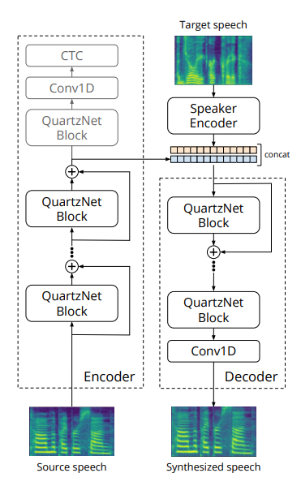
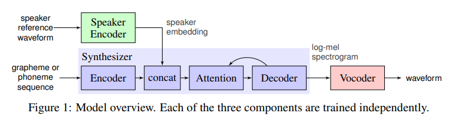

# SpeechToSpeech

Assumptions:

- It is assumed that we will work only with English speech.
- The focus will be on speed (not quality) and real-timeness of the result (0.5 sec delay max). 

Data used for training:

- http://www.openslr.org/12/
- https://www.openslr.org/resources/12/dev-other.tar.gz``

-----
First approach is ConVoice model ("speech-to-speech"):``

- https://arxiv.org/pdf/2005.07815.pdf
- https://arxiv.org/pdf/1910.10261.pdf
- ...

-----

Another approach is real-time voice cloning ("speech-to-text-to-speech"):

- https://habr.com/ru/post/465941/
- https://github.com/CorentinJ/Real-Time-Voice-Cloning
- https://github.com/coqui-ai/tts
- https://arxiv.org/pdf/1806.04558.pdf
- https://google.github.io/tacotron/

Such kind of model will consist of four neural networks:

- The first one will convert text into phonemes (g2p)
- The second one will convert the speech we want to clone into a vector of signs (numbers)
- The third one will synthesize Mel spectrograms based on the outputs of the first two
- And finally, the fourth will receive sound from the spectrograms.

It is the most popular approach nowadays!

-----

Yet another approach, using variational auto-encoders:

- https://arxiv.org/pdf/1905.05879.pdf

-----

- https://arxiv.org/pdf/1811.00002.pdf