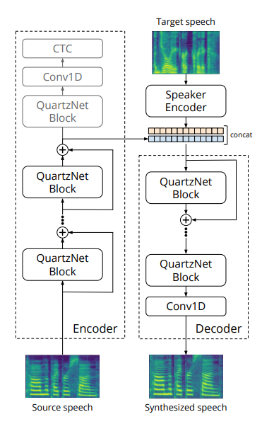
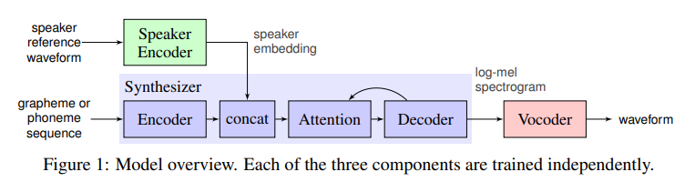

# SpeechToSpeech

#---

Implementation of the "speech-to-speech" approach based on:

- https://arxiv.org/pdf/2005.07815.pdf
- ...

Assumptions:

- It is assumed that we work only with English speech.
- The focus will be on speed (not quality) and real-timeness of the result (0.5 sec delay max). 

Data used fo training:

- http://www.openslr.org/12/
- https://www.openslr.org/resources/12/dev-other.tar.gz

#---

Another approach "speech-to-text-to-speech" can be implemented based on:

- https://github.com/coqui-ai/tts
- https://arxiv.org/pdf/1806.04558.pdf
- https://google.github.io/tacotron/
- https://habr.com/ru/post/465941/

Such kind of model will consist of four neural networks:

- The first one will convert text into phonemes (g2p)
- The second one will convert the speech we want to clone into a vector of signs (numbers)
- The third one will synthesize Mel spectrograms based on the outputs of the first two
- And finally, the fourth will receive sound from the spectrograms.